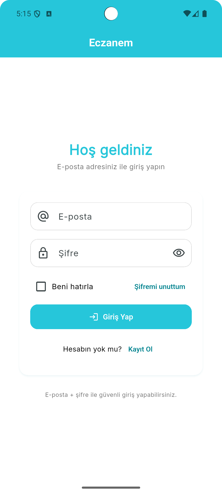
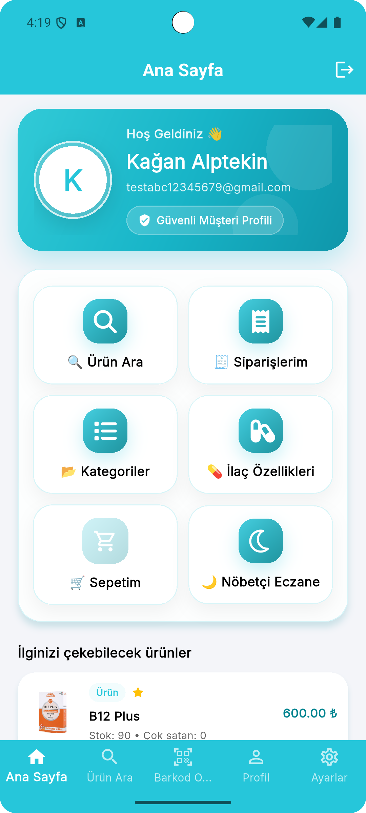
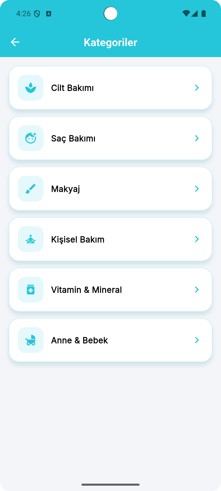
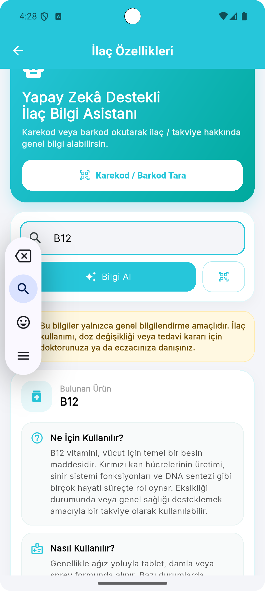
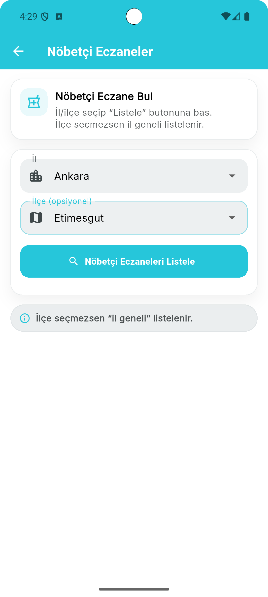
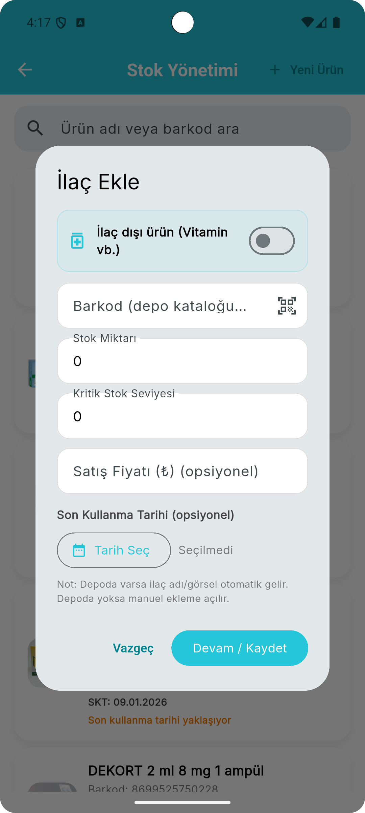
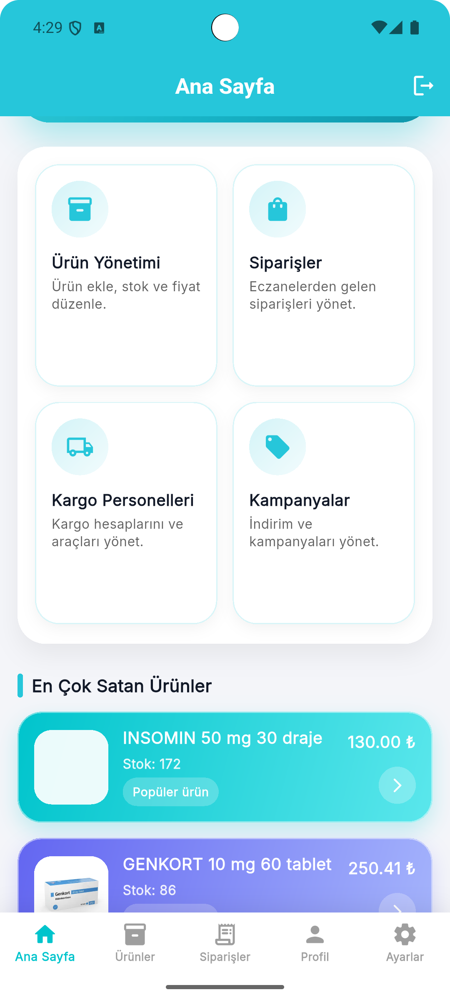
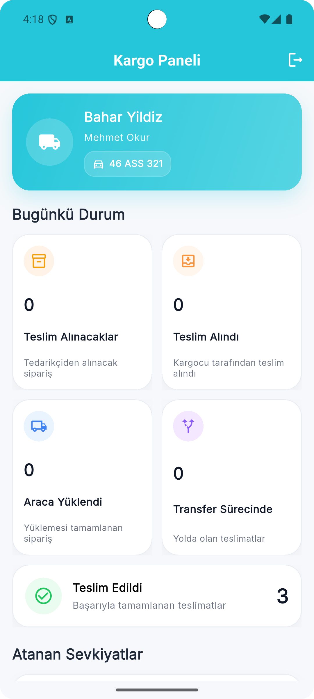
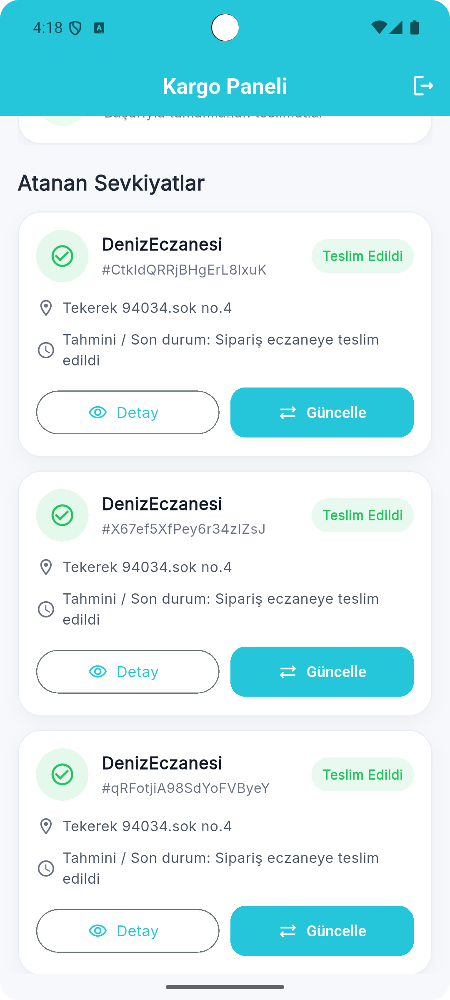
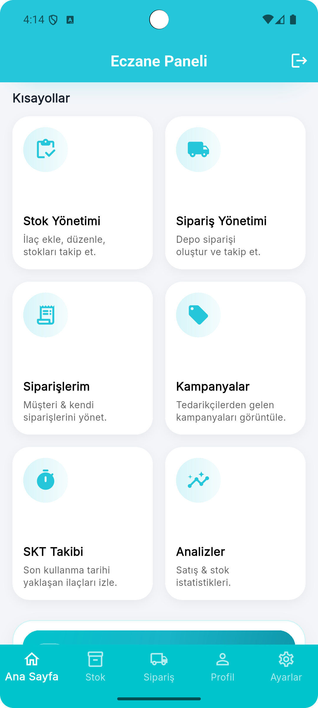

# Eczanem

A multi-role mobile platform developed with Flutter to digitalize medicine availability, pharmacy inventory, ordering, procurement, and delivery workflows.

Eczanem is designed to connect customers, pharmacies, pharmaceutical warehouses, and couriers through a unified digital ecosystem.

Customers can search for medicines and healthcare products, discover nearby pharmacies, and create orders. Pharmacies can manage inventory and customer orders, monitor critical stock levels, and request unavailable products from other pharmacies or pharmaceutical warehouses. Courier workflows allow prepared orders and deliveries to be tracked through the application.

> Eczanem is currently under active development.
> The source code is maintained in a private repository.

## Key Features

* Customer, pharmacy, warehouse, and courier roles
* User registration and authentication
* Medicine and healthcare product search
* Barcode-based product lookup
* AI-assisted medicine information
* Nearby and on-duty pharmacy discovery
* Province and district-based pharmacy filtering
* Shopping cart and order creation
* Order status tracking
* Pharmacy inventory management
* Critical stock monitoring
* Product requests between pharmacies and warehouses
* Courier assignment and delivery management
* Real-time notification system
* Profile and address management
* Light and dark theme support
* Privacy policy and KVKK-oriented consent flows

## User Roles

### Customers

Customers can search for medicines and healthcare products, discover nearby or on-duty pharmacies, manage addresses, create orders, and follow their order status.

### Pharmacies

Pharmacies can manage products, inventory levels, customer orders, supply requests, and delivery preparation workflows.

### Pharmaceutical Warehouses

Warehouses can review incoming product requests, manage supply operations, and coordinate order fulfillment with pharmacies.

### Couriers

Couriers can access assigned deliveries, review delivery details, enter vehicle and tracking information, and manage delivery progress.

## Technology Stack

* Flutter and Dart
* Provider state management
* Firebase Authentication
* Cloud Firestore
* Firebase Cloud Functions
* Firebase Cloud Messaging
* Firebase Secret Manager
* Google Maps and location services
* Barcode scanning technologies
* AI-assisted information services
* Material Design

## Architecture and Development

The application uses a modular, role-based Flutter architecture. Authentication, application state, data access, user interfaces, and backend workflows are separated into maintainable layers.

My responsibilities included:

* Flutter application architecture and development
* Multi-role authorization and navigation
* Responsive mobile interface implementation
* Firebase Authentication integration
* Firestore data modeling and integration
* Cloud Functions development
* Secure AI service integration
* Push notification workflows
* Google Maps and location integration
* Barcode scanning functionality
* Inventory and order workflow development
* Courier and delivery management
* Light and dark theme implementation
* Privacy and consent interfaces

## Main Workflows

### Medicine Discovery

Users can search for medicines and healthcare products using text search or barcode scanning.

### Pharmacy Discovery

Location services help users discover nearby pharmacies, on-duty pharmacies, and pharmacies filtered by province or district.

### Inventory and Procurement

Pharmacies can monitor inventory, identify critical stock levels, and request products from other pharmacies or warehouses.

### Ordering and Delivery

Customers can create orders, pharmacies can prepare them, and couriers can manage the delivery process through role-specific interfaces.

### Notifications

Firebase Cloud Messaging supports timely updates related to orders, stock requests, and delivery workflows.

## Security and Privacy

* Sensitive AI credentials are managed through Firebase Secret Manager.
* User authentication is handled through Firebase Authentication.
* Private configuration and production credentials are excluded from the public showcase.
* Privacy policy and KVKK-oriented consent interfaces are included in the application.

## Project Status

Eczanem is currently under active development and has not yet been published on application stores.

The source code, backend configuration, Firebase production resources, and private credentials are maintained in a private repository.

## Screenshots

  
  
  

  
  
  

  
  
  

  

## Medical Disclaimer

AI-assisted and product information features are intended for informational purposes only. They do not replace professional medical advice, diagnosis, prescriptions, or pharmacist consultation.

## Developer

**Ali Aytekin**
Flutter Mobile Application Developer

* [GitHub](https://github.com/AliAytekin1)
* [LinkedIn](https://www.linkedin.com/in/aliaytekin1)

## Source Code

This repository is intended only for project presentation and portfolio purposes. The production source code is private.

---

© 2026 Ali Aytekin. All rights reserved.

